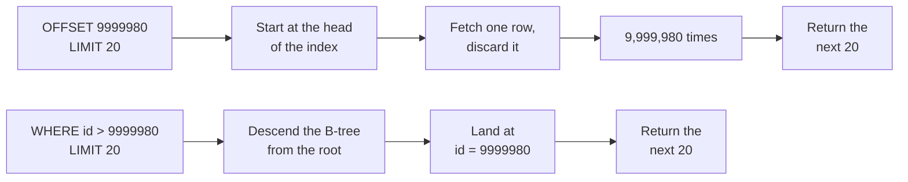
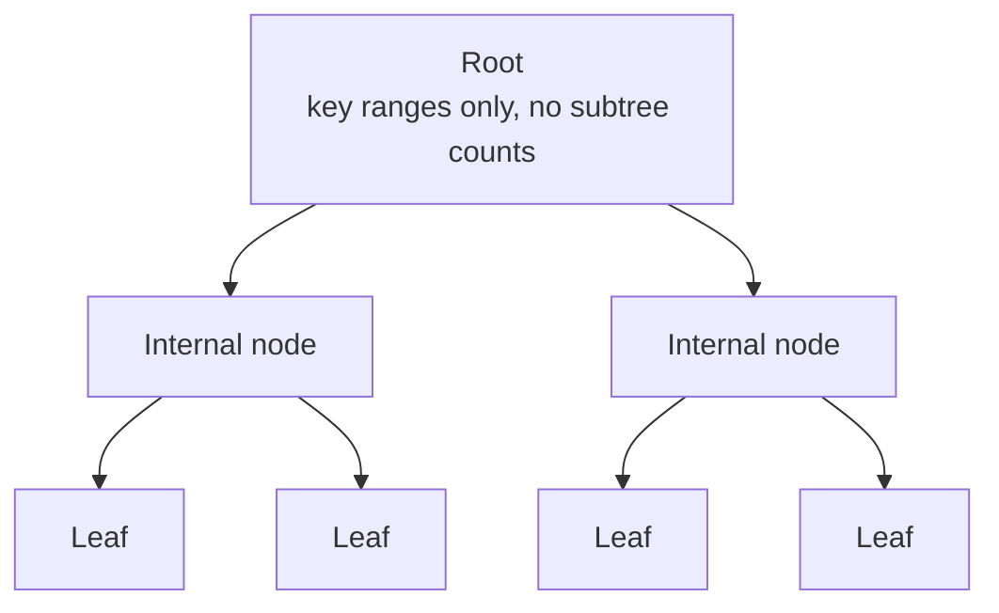

`OFFSET 9999980 LIMIT 20` does not skip 9,999,980 rows. It reads every one of them, builds each tuple, and throws it away. To hand back 20 rows it touches 110,659 buffer pages — 865 MB of a 1.2 GB table — and `EXPLAIN` reports it without flinching.

I knew deep pages were slow. Asked to explain *why*, I said "it skips ahead, and skipping that far costs something" — which is wrong in the one way that matters. Nothing jumps. So I loaded 10 million rows into PostgreSQL and measured it.

## The setup

PostgreSQL 17.11 (`postgres:17-alpine`), Docker 29.4.1, Ryzen 7 5700X, 78 GB RAM, `shared_buffers` left at the default 128 MB.

```sql
CREATE TABLE orders (
    id           bigint       PRIMARY KEY,
    created_at   timestamptz  NOT NULL,
    customer_id  bigint       NOT NULL,
    status       varchar(16)  NOT NULL,
    total_amount integer      NOT NULL
);

CREATE INDEX orders_created_at_id_desc_idx
    ON orders (created_at DESC, id DESC);
```

Ten million generated rows, with one deliberate property: `created_at` repeats every 100 rows. Real order tables have ties within the same second, and that matters in part 2.

Keep these physical sizes in mind — the `Buffers` numbers later resolve straight back into them at 8 KB per page:

| Object                          | Size     | Pages   |
| ------------------------------- | -------: | ------: |
| `orders` heap                   | 651 MB   | ~83,000 |
| `orders_pkey`                   | 214 MB   | ~27,000 |
| `orders_created_at_id_desc_idx` | 301 MB   | ~38,000 |

Every query below returns exactly 20 rows and selects only `id, created_at`. Otherwise you cannot tell which difference came from the pagination method.

## The shape of the numbers

Five runs each, same session, no `EXPLAIN` attached:

| Depth     | OFFSET     | Cursor   |
| --------: | ---------: | -------: |
| 0         | 0.292 ms   | 0.130 ms |
| 99,980    | 7.009 ms   | 0.027 ms |
| 999,980   | 68.370 ms  | 0.020 ms |
| 4,999,980 | 396.669 ms | 0.021 ms |
| 9,999,980 | 791.349 ms | 0.016 ms |

The ratio at the bottom row is about 49,000x, and it is the least interesting number here. Look at the shape of each column instead. Ten times the depth, ten times the time — OFFSET is cleanly linear. The cursor column does not move at all across a 100,000x change in depth.

This is not a constant factor. It is a different complexity class.

> **Note:** The cursor timings sit at 0.016–0.027 ms, close to measurement resolution. Do not read the 49,000x as precise. The claim is that the column is flat.



## EXPLAIN says it out loud

The plain OFFSET at depth 9,999,980:

```text
 Limit  (cost=343020.75..343021.43 rows=20 width=16)
        (actual time=1171.800..1171.803 rows=20 loops=1)
   Buffers: shared read=110659
   ->  Index Scan using orders_pkey on orders
        (actual time=0.027..934.060 rows=10000000 loops=1)
         Buffers: shared read=110659
 Execution Time: 1172.019 ms
```

Three things to read.

**The `Limit` node returns 20 rows. Its child returns 10,000,000.** That gap is the whole story. `Index Scan` produced ten million rows; `Limit` discarded 9,999,980 of them and passed 20 up. Read, then discarded — not skipped.

**`Buffers` scales with depth, not with the result size:**

| Depth     | Index Scan rows | Buffers |
| --------: | --------------: | ------: |
| 0         | 20              | 4       |
| 99,980    | 100,000         | 1,110   |
| 999,980   | 1,000,000       | 11,069  |
| 4,999,980 | 5,000,000       | 55,331  |
| 9,999,980 | 10,000,000      | 110,659 |

Now put 110,659 next to the table above. The primary key index is ~27,000 pages and the heap is ~83,000. They sum to ~110,000. The query walked the entire index *and* the entire heap to return a few hundred bytes.

**Most of the time is the discarding.** `Index Scan` alone is 934 ms of the 1,172 ms total.

> **Note:** The average table said 791 ms for this query; this plan says 1,172 ms. Different instruments. The table is five bare runs; this is one run under `EXPLAIN (ANALYZE, BUFFERS)`, which timestamps every node and charges more the more rows pass through. Compare absolute numbers within the table, and structure within the plans. Every comparison below is plan-to-plan.

## Why it can only count

An index maps **key to location**. "Where is `id = 9999980`" takes a handful of node lookups from the root. OFFSET asks something else:

> Which row is the 9,999,981st when sorted?

A PostgreSQL B-tree cannot answer that, because rank is not stored anywhere in it.



Every node knows which key ranges lie beneath it. None of them knows *how many* entries do. If they did, you could descend by rank — "the left subtree holds 5 million, so go right" — and deep OFFSET would cost the same as a cursor. Such structures exist; order-statistic trees and ranked B-trees are exactly this. PostgreSQL's B-tree is not one.

The leaves are chained together in key order, so walking the whole set is easy. Walking is the only thing on offer.

And there is a second layer. **MVCC visibility is not in the index.** Whether an index entry is visible to your transaction generally requires checking the heap (the visibility map can skip this when a page is known all-visible). So OFFSET does not want the Nth entry. It wants *the Nth row currently visible to you*. Even a subtree counter would count entries, not visible rows.

That leaves exactly one strategy: walk from the start and count.

OFFSET's cost is not a missing optimisation. It falls straight out of a structure that does not store rank.

## Making the discarding cheaper

Discarding has internals worth separating. The scan above also returns `created_at`, which is not in the primary key index — so each of the ten million discarded rows triggers a heap visit. That part is pure waste.

Skip on `id` alone, then fetch the heap for the surviving 20. This is the deferred join:

```sql
SELECT o.id, o.created_at
FROM orders o
JOIN (
    SELECT id FROM orders ORDER BY id LIMIT 20 OFFSET 9999980
) t USING (id);
```

```text
 Nested Loop  (actual time=799.685..799.704 rows=20 loops=1)
   Buffers: shared hit=82 read=27326
   ->  Limit  (actual time=799.620..799.623 rows=20 loops=1)
         ->  Index Only Scan using orders_pkey on orders
               (actual time=0.023..561.950 rows=10000000 loops=1)
               Heap Fetches: 0
 Execution Time: 800.047 ms
```

`Heap Fetches: 0`, and buffers drop to 27,408 — almost exactly the ~27,000-page primary key index and nothing else. The heap is gone from the scan entirely.

| Plan-to-plan   | Plain OFFSET | Deferred join | Change |
| -------------- | -----------: | ------------: | -----: |
| Buffers        | 110,659      | 27,408        | **1/4** |
| Execution time | 1,172 ms     | 800 ms        | 2/3    |

Here is the part I did not expect. **Pages fell to a quarter; time only fell to two thirds.** Cutting I/O did not cut time proportionally, which means the dominant cost was never the pages. The Index Only Scan alone spends 562 ms walking 10 million entries: about 56 ns per row, just to produce a tuple and drop it.

And `rows=10000000` is unchanged. The constant improved. The order is still O(depth).

## It is not the disk

`Buffers: shared read` only means "not in PostgreSQL's shared buffers." Whether it reached the physical device or came from the OS page cache is a separate question — and a measurable one:

```sql
SET track_io_timing = on;
```

```text
 Limit  (actual time=1176.118..1176.121 rows=20 loops=1)
   Buffers: shared read=110659
   I/O Timings: shared read=133.496
 Execution Time: 1176.317 ms
```

110,659 pages cost **133 ms of I/O — 11% of the runtime**, about 1.2 µs per page. With 1.2 GB of data on a host with 78 GB of RAM, those reads were almost certainly served by the OS page cache.

The other ~1,040 ms is not time PostgreSQL attributed to reading anything. It is scanning ten million index entries, forming tuples, and discarding them.

So "OFFSET is slow because disks are slow" does not survive contact with the measurement. Faster storage buys back roughly a tenth of it. The O(depth) term is CPU work, and it stays.

## Takeaway

OFFSET is not skipping. It is reading and discarding, because nothing in a B-tree can answer "which row is Nth right now" — and a cursor is fast not because it is cleverer, but because it replaces that question with "which rows come after this key," which an index *can* answer.

Part 2 is the other half: the reason to switch is usually not speed at all, and the four things keyset pagination needs before it works.
