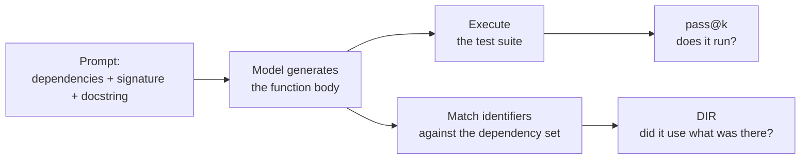

Both models passed the tests. Both rewrote a function that was sitting in their own prompt, twenty lines up.

That is a worked example from the RepoExec paper, and it is the reason the benchmark exists. `pass@k` cannot see it — the tests are green. The bill arrives six months later, when you change the function that was supposed to be the only implementation and the change does not take everywhere.

RepoExec ([NAACL 2025 Findings](https://aclanthology.org/2025.findings-naacl.82/), Nam Le Hai, Dung Manh Nguyen, Nghi D. Q. Bui, FPT Software AI Center) adds a second axis next to correctness: of the dependencies you handed the model, how many did it actually call. Across 18 models the best pass@1 is 42.57%.

## Two axes, not one



The second axis is the new one. **Dependency Invocation Rate (DIR)** is the share of provided dependencies that appear in the generated code. With `Dg` the set of identifiers in the output and `Ds` the set of dependencies extracted from the reference solution:

```text
DIR = |Dg ∩ Ds| / |Ds|
```

Match-based metrics like BLEU weigh every token the same, so a valid alternative implementation scores badly for no good reason. DIR only looks at the identifiers that name dependencies. Calling `_create_future()` instead of `Future()` is not a stylistic variant — it is the choice the author of the repository already made.

The benchmark is 355 Python problems, each with an executable environment. Tests are LLM-generated, then filtered for syntax and execution and pushed for coverage: 99.45 test cases and 96.25% line coverage per problem on average. Prompts are short — 362.92 tokens on average with full dependency bodies, 253.05 with bodies stripped. 22.8% involve a cross-file dependency.

The coverage push is worth noting on its own. Strengthening the tests dropped pass@1 by over 5 points. Solutions that had been scoring as correct started failing, and the paper's diagnosis is that most of them had ignored the supplied context entirely and solved the natural-language description instead. They failed at the edges — which is exactly where the repository's own validation helpers live.

## Nobody is close

Full context, ordered by pass@1:

| Model                | pass@1 | DIR   |
| -------------------- | ------ | ----- |
| DeepSeek-R1          | 42.57  | 70.86 |
| DeepSeek-V3          | 42.00  | 80.35 |
| CodeLlama-34b-Python | 40.93  | 68.85 |
| CodeLlama-13b-Python | 38.65  | 62.26 |
| GPT-4o               | 37.14  | 81.43 |
| GPT-4o-mini          | 30.29  | 74.75 |
| GPT-3.5              | 27.27  | 63.59 |

Every model is under 50% pass@1 on 355 problems with a single level of dependencies supplied.

Look at GPT-4o-mini. DIR 74.75, pass@1 30.29. It reaches for the dependencies and gets the call wrong. DIR counts whether a name appeared, not whether it was used correctly, which is precisely why the paper insists on reading both numbers together. Cross them and you get four quadrants:

|               | Low DIR — ignores the deps      | High DIR — uses the deps  |
| ------------- | ------------------------------- | ------------------------- |
| **High pass@1** | Works, but reimplements — debt | The target                |
| **Low pass@1**  | Just broken                    | Over-built, over-complicated |

The paper's finding is that the two model families fail on opposite diagonals. Pretrained models land top-left: correct code that quietly rewrites what was already there. Instruction-tuned models land bottom-right: they find the dependency, then wrap it in machinery nobody asked for.

## Half the context was worse than none

Dependencies are supplied at three levels. **Full** is signature + docstring + body; **Medium** is signature + docstring; **Small** is signature only. Information content runs Full > Medium > Small. Performance does not (BasePrompt, pass@1):

| Model                | Full  | Medium | Small |
| -------------------- | ----- | ------ | ----- |
| CodeLlama-13b-Python | 38.65 | 32.96  | 35.66 |
| StarCoder            | 28.08 | 22.54  | 25.54 |
| StarCoder2-15b       | 27.77 | 18.70  | 23.27 |
| Phi-2                | 19.04 | 14.54  | 14.82 |

Full > Small > Medium, every time. Trimming halfway is worse than trimming all the way.

The explanation is the good part. A Medium-context dependency — signature, docstring, no body — has exactly the same shape as the target function's prompt. So the model reads the context as a run of few-shot examples with the last one blank, and treats the job as filling in the blank. The evidence is empty output: with Medium context, over 31% of StarCoder2's generations are empty function bodies. It did not lack information. It misread what the information was for.

That kills the "more context vs. less context" framing outright. What moved the numbers was not volume but **what the supplied text looks like it is asking for**.

## The example

The Tornado case. `maybe_future` converts a value into a `Future`. The prompt supplies `_create_future()`, which builds a `Future` and then strips the extra asyncio debug stack entries the wrapper itself introduced.

The reference solution:

```python
def maybe_future(x: Any) -> Future:
    if is_future(x):
        return x
    else:
        fut = _create_future()
        fut.set_result(x)
        return fut
```

The pretrained model — tests pass:

```python
def maybe_future(x: Any) -> Future:
    if is_future(x):
        return x
    future = Future()          # builds it by hand, skipping _create_future()
    future.set_result(x)
    return future
```

The instruction-tuned model — tests also pass:

```python
def maybe_future(x: Any) -> Future:
    if isinstance(x, Future):   # is_future() is right there
        return x
    elif isawaitable(x):        # a branch the spec never asked for
        return asyncio.ensure_future(x)
    else:
        future = Future()
        future.set_result(x)
        return future
```

Neither calls `_create_future()`. The entire reason that function exists — the debug-info cleanup — is gone from both. The paper calls this a failure to optimise memory use and flags it as code smell and technical debt.

And no test catches it. Only DIR reports that `_create_future` was never invoked.

## Two things that helped

**Show it the errors.** Feed back the failing test output, up to three rounds:

| Round | GPT-3.5 | WizardCoder | CodeLlama-13b-Python |
| ----- | ------- | ----------- | -------------------- |
| 0     | 27.04   | 34.37       | 39.44                |
| 1     | 36.34   | 40.85       | 39.44                |
| 2     | 40.00   | 41.69       | 39.44                |
| 3     | 41.97   | 42.54       | 39.44                |

GPT-3.5 gains nearly 15 points, and DIR rises by over 7 points as well — debugging improves dependency use, not just correctness. CodeLlama-13b-Python does not move a single digit across three rounds. Whether an error log is worth sending back is a per-model fact, which matters if you are wiring an agent loop.

**Fine-tune on dependency-annotated data.** The authors built a set from 1,555 repositories and 154,818 functions and LoRA-tuned on it (DepIT):

| Model              | Full pass@1 | Full DIR  | Small pass@1 | Small DIR |
| ------------------ | ----------- | --------- | ------------ | --------- |
| Phi-2              | 19.04       | 48.22     | 14.82        | 44.54     |
| Phi-2 + DepIT      | 20.20       | **61.66** | 20.31        | **70.30** |
| StarCoder2         | 27.77       | 60.57     | 23.27        | 53.49     |
| StarCoder2 + DepIT | 28.45       | **69.76** | 27.27        | **73.98** |

pass@1 barely moves. DIR jumps 10-25 points. Using what is already there is a separable, learnable skill.

The part I keep thinking about: after tuning, Small context catches up with Full. Phi-2 scores higher on both metrics with signatures alone. That is two models, not a general law — but it says a signature and a good name can be enough to get a dependency called, without shipping its body.

## Where this stops

- **One level of dependencies.** The paper lists this first in its own limitations: only what the target function calls directly, no transitive graph. Input-length budget. Real comprehension goes deeper.
- **Python, 355 problems, one function at a time.** Not multi-file changes.
- **Tests are LLM-generated.** High coverage, but not human-annotated.
- **DIR only counts invocation.** Whether the call was correct needs pass@1 alongside it, and calling a dependency that should not have been called is not measured at all.
- **Early-2025 models.** These are DeepSeek-R1 and GPT-4o-era numbers. Do not carry 42.57% forward to whatever you are using today.
- **Context length barely correlates with score.** Model size and family dominate. With 363-token prompts there is no haystack to search — the dependency extractor already did the selecting. Being able to hold a long context and being able to pick the right one are different jobs, and only the first belongs to the model.

## What I'd change in a repo

Two things follow for me, and neither is exotic.

Invest in the public face — names, signatures, docstrings written from the caller's side. That has always been called good design; DIR just converts "readable" into "how often an LLM reuses this", which is a number you can move. For a function that breaks something when it is skipped, put the reason in the docstring: not "checks for a string" but "all str checks go through this so validation stays in one place."

And stop treating a green test run as a review signal for generated code. Two of the paper's three worked examples reimplement a supplied dependency while passing. The question worth asking of a diff is which existing function it should have called — which is a static-analysis job, not a human one. `pydepcall`, the extractor the authors released, walks dependencies up to 100 levels deep, so the raw material is there. I have not built this yet.

## Takeaway

Measure whether generated code calls what your repository already has, separately from whether it passes. They are different abilities, and the second one hides the first.

---

Nam Le Hai, Dung Manh Nguyen, Nghi D. Q. Bui. "On the Impacts of Contexts on Repository-Level Code Generation." *Findings of the ACL: NAACL 2025*, pages 1496-1524. Dataset and code: <https://github.com/FSoft-AI4Code/RepoExec>
