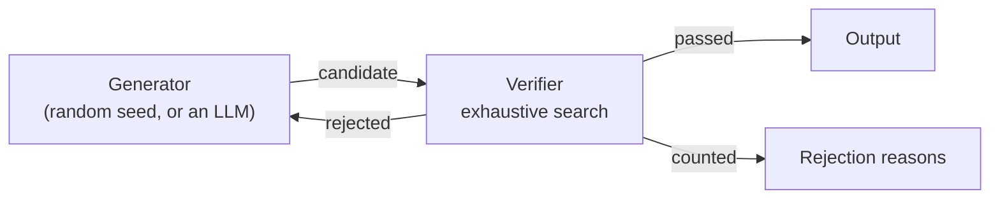

I wrote a puzzle generator whose acceptance rate is **0.26%**. It throws away 99.7% of everything it produces, and that is the design working as intended, not failing. Generating five valid puzzles takes 1,947 attempts and 84 milliseconds.

The point is not the puzzles. The point is that the generator makes no correctness guarantee at all, and a verifier makes every one of them. Once you split those two responsibilities, "make the generator smarter" stops being the obvious optimisation — and that is exactly the position you are in when the generator is an LLM.

## The loop

`verigen` is a Go CLI that produces cryptarithmetic puzzles — alphametics, the `SEND + MORE = MONEY` genre, where each letter stands for a distinct digit and the sum has to hold. The known answer to that one is `9567 + 1085 = 10652`.



There is one rule, and everything else follows from it:

> **The generator guarantees nothing. Every guarantee lives in the verifier.**

The generator throws plausible-looking letter combinations at the wall. The verifier does an exhaustive search and confirms two things: that a solution exists, and that it is unique. Anything that fails either check is discarded and the loop asks for another candidate.

The loop itself knows nothing about cryptarithmetic. Implement a `Domain` interface and any other puzzle rides the same loop.

## What the log actually says

Five puzzles, seed 7:

```text
── Puzzle 2  [hard]
   HAIKU + BONSAI = KOKORO
   Answer: 96542 + 378165 = 474707
   (attempts before this seed landed: 624)
```

```text
=== generate/verify loop [alphametic] ===
seed=7  output=5 puzzles  total attempts=1947  elapsed=84ms
acceptance rate = 0.2568%  (average 389 generations per puzzle)
--- rejection reasons ---
  no unique solution                  770  (39.55%)
  no solution                         695  (35.70%)
  more than 10 distinct letters       477  (24.50%)
  ok                                    5  ( 0.26%)
```

Nearly 40% of candidates have more than one valid solution. Another 36% have none. A quarter cannot possibly have one and are rejected before the search starts. Five survive.

Filtering by difficulty makes it worse: asking for easy puzzles drops the acceptance rate to 0.03%, about 3,200 generations each. It still finishes instantly.

I never tried to raise that number. Making the generator cleverer costs my time; making the verifier run 1,947 times costs 84ms. **When generation is cheap, you can afford to be stupid on that side and pay for it in verification.** The log is what makes that trade-off intuitive rather than theoretical — I did not really believe it until I saw 99.7% of the work land in the discard pile without the wall-clock time moving.

## What the verifier has to guarantee

The loop is only worth as much as the assertions the verifier can actually make. For alphametics, that is:

| Guarantee | How |
| --- | --- |
| A solution exists | Exhaustive search, column by column, carrying digits |
| The solution is unique | Keep searching after the first hit; reject if a second exists |
| More than 10 distinct letters means no solution | Pigeonhole. Rejected before the search runs |
| No leading zero | Constrain the first letter of every multi-character word |

Three design decisions made that table hold up.

**I tested the verifier first.** If the verifier is wrong, every guarantee downstream is a lie, and nothing in the output looks wrong. So the first tests were puzzles with published answers — `SEND + MORE = MONEY` → `9567 + 1085 = 10652`, `CROSS + ROADS = DANGER` → `96233 + 62513 = 158746` — plus explicit cases for "no solution", "not unique", and the 11-letter rejection. The generator's tests came later. A broken generator lowers the acceptance rate; a broken verifier invalidates everything.

**Pre-filtering only encodes facts, never heuristics.** More than ten distinct letters cannot map to ten digits, so no solution exists — pigeonhole, not a guess. That check alone accounts for 24.5% of rejections and removes the most expensive searches before they begin. Note where the optimisation went: not into a smarter generator, but into the verifier's front door, rejecting hopeless candidates fast.

**Difficulty is labelled a proxy, out loud.** The difficulty score counts branch points during the search. That correlates with how much trial and error a human needs, probably — but I have not measured it against actual people, so the code and the docs both call it a proxy. Separating what you can assert from what you merely believe is not a nicety here. It is the discipline that keeps the word "verified" meaningful everywhere else.

## Where this already is, and where it isn't

Swap the random generator for an LLM and the diagram is unchanged. That substitution is not a new idea in 2026 — in the major application areas it is already standard practice.

**Code generation.** Formalised as loop engineering: hooks and agent harnesses that refuse to let a run finish until tests, types and lint pass. Cognition's 2025 annual review put the merge rate of Devin-generated PRs at 67%, up from 34% the year before.

**SQL generation.** Snowflake's Cortex Analyst moved automatic optimisation of verified queries into preview in December 2025. Vanna AI ships self-correction from dry-run errors as a standard feature. `EXPLAIN`, schema matching, and retry-on-execution-error are table stakes for text-to-SQL products.

**Structured output.** This one has gone past verification entirely: XGrammar constrains decoding so schema-violating tokens are never emitted, and it is now a standard backend in vLLM, SGLang and TensorRT. OpenAI's Structured Outputs works the same way. "Parse the JSON, catch the error, retry" is close to obsolete.

**Proofs.** The most spectacular case. AlphaProof, paired with AlphaGeometry 2, scored 28/42 at the 2024 IMO — silver-medal level. In May 2026 a DeepMind follow-up system reported on arXiv solving 9 of 353 open Erdős problems. The mechanism is continuous with `verigen`: generate candidate proofs, run them through Lean 4 as a mechanical verifier, repeat until one passes, at an enormous scale. DeepSeek-Prover-V2 is the same shape. What exhaustive search does for "this puzzle has exactly one solution", Lean does for "this theorem holds".

The common precondition is that **the verifier can decide the question mechanically**. Where it cannot — is this prose any good? — the whole design has nothing to offer.

What is still open is the design of the verifiers themselves.

**Round-trip verification.** Transform the output back and check that it matches the input. Schema validation is everywhere; round-trip verification of semantic equivalence is not, and ETL and code migration between languages or frameworks are where it would pay.

**A uniqueness-equivalent guarantee.** My verifier does not stop at "a solution exists"; it asserts the solution is unique. The LLM equivalent is not stopping at "the code runs" but checking that behaviour is uniquely determined by the spec — property-based testing that finds no counterexample gets close.

**A quality filter.** `verigen` cannot reject a puzzle that is solvable but boring, and nothing in the LLM stack reliably rejects code that passes its tests but is badly designed. The metric itself is the unsolved part.

## When this works

Three conditions, in order of how often they are the one that breaks:

**The verifier must be strict — and honest about its limits.** A verifier that appears to guarantee something it does not makes the entire loop a lie. Assert nothing you cannot assert. Labelling my difficulty score a proxy is the small version of this; treating "the tests pass" as "the code is correct" is the expensive version.

**Generation must be cheap.** 1,947 attempts in 84ms is why a 0.26% acceptance rate is survivable. An LLM call is hundreds of milliseconds to seconds, so the same acceptance rate would be absurd. With an expensive generator you have to tune both sides: prompts that raise the hit rate *and* a verifier strict enough to be worth the round trip.

**Verification must not cost more than generation.** Exhaustive search is expensive in principle and still fits inside those 84ms. Test suites and type checks do not always fit so comfortably. If verifying costs more than generating, the loop does not close.

## What I'd build next

Classic puzzles were a deliberately easy setting: a domain where a verifier can make total guarantees by brute force, so I could think about verifier design without the verifier itself being the hard part. The loop is standard practice now. The interesting question has moved to what, exactly, your verifier is willing to assert.

Next on the list: a quality filter, since right now I only guarantee that a puzzle is solvable and nothing about whether it is worth solving; more domains (polyomino tiling is done, knots and definite integrals are candidates); and checking that difficulty proxy against actual human solvers, so I can stop calling it a proxy.

The repository: <https://github.com/hidetzu/verigen>
